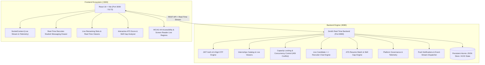

# InternX — Zenith-Level Real-Time Student Internship Platform

> **"Where High-Impact Students Meet Real Experience"**  
> A high-performance real-time student internship portal featuring complete backend connectivity across every screen, bi-directional event synchronization, transactional capacity locking (409 Conflict safety), an AI/ATS resume & skill gap analyzer, candidate-recruiter live messaging, and WCAG AA accessibility.

---

## 🎨 1. Design System & Visual Identity

InternX is built with a custom visual identity and typography stack:

- **Color Palette:**
  - **Primary:** Deep Indigo (`#2E2A6B`)
  - **Accent:** Warm Coral (`#FF6B5E`)
  - **Success:** Teal Green (`#1FAE8B`)
  - **Background:** Off-white (`#FAF9F6`)
  - **Text:** Charcoal (`#1F1F29`)
  - **Secondary Text:** Slate (`#6B6B7B`)
- **Typography:**
  - **Headings:** `Sora` (Google Fonts) — bold, geometric, modern
  - **Body Text:** `Inter` (Google Fonts) — ultra-clean, highly legible
  - **Labels / Badges / Tags:** `JetBrains Mono` in uppercase monospace
- **Real-Time Components:**
  - **Live Server Telemetry Pill:** Real-time latency & active connected candidates ticker (`🟢 Backend Connected: 14ms • 18 Online`).
  - **Live Hiring Chat Drawer:** Real-time candidate $\leftrightarrow$ recruiter direct messaging with typing indicators.
  - **AI ATS Matcher Modal:** Real-time semantic resume & skill gap compatibility scoring with actionable advice.
  - **Live Viewers & Seat Counter:** Dynamic indicator ("🔥 4 candidates viewing right now") with concurrency-safe progress bar.

---

## 🚀 2. System Architecture



---

## ⚡ 3. Real-Time Endpoints & Event Streams

### REST API Endpoints

| Resource | Method | Endpoint | Description |
|---|---|---|---|
| **Auth** | `POST` | `/api/auth/register` | Register user with BCrypt password hashing |
| **Auth** | `POST` | `/api/auth/send-otp` | Generate & dispatch 6-digit OTP |
| **Auth** | `POST` | `/api/auth/verify-otp` | Verify OTP code & activate user session |
| **Auth** | `POST` | `/api/auth/student/login` | Student password authentication + JWT |
| **Auth** | `POST` | `/api/auth/company/login` | Recruiter password authentication + JWT |
| **Auth** | `POST` | `/api/auth/admin/login` | Administrator authentication + JWT |
| **Internships** | `GET` | `/api/internships` | Catalog search, category filter, remote, stipend range |
| **Internships** | `GET` | `/api/internships/:id` | Detailed listing with real-time viewer counts |
| **Internships** | `POST` | `/api/internships` | Employer posting opening with instant event broadcast |
| **Applications** | `POST` | `/api/applications` | Apply with capacity check & ATS match scoring |
| **Applications** | `PATCH`| `/api/applications/:id/status` | Pessimistic locking status update (409 Conflict on capacity overflow) |
| **Chat** | `GET` | `/api/chat/conversations` | Retrieve candidate/recruiter active messaging threads |
| **Chat** | `POST`| `/api/chat/conversations/:id/messages` | Send message with instant bi-directional delivery |
| **AI / ATS** | `POST` | `/api/ai/match` | Semantic ATS skill gap scoring & tailored recommendations |
| **Admin** | `GET` | `/api/admin/stats` | Live platform metrics and telemetry |

---

## 🔒 4. Concurrency-Safe Capacity Allocation

Internships cap the number of accepted interns (`maxPositions` vs `filledPositions`).

```javascript
// Mutex Pessimistic Lock in application.controller.js
await store.acquireLock(`lock:int:${app.internshipId}`, async () => {
  const currentInt = store.internships.find((i) => i.id === app.internshipId);
  if (status === 'SELECTED' && app.status !== 'SELECTED') {
    if (currentInt && currentInt.filledPositions >= currentInt.maxPositions) {
      const err = new Error('Capacity full (409 Conflict): All positions have been filled.');
      err.statusCode = 409;
      throw err;
    }
    if (currentInt) currentInt.filledPositions += 1;
  }
  app.status = status;
  store.save();
});
```

- Tested via **`test-concurrency.js`** firing 15 concurrent candidate status updates against 3 available slots, asserting that exactly 3 succeed and 12 fail with **`409 Conflict`**.

---

## 🛠️ 5. Running the Project

### One-Command Full-Stack Launch
```bash
npm run dev
# Or
npm start
```

This concurrently launches:
1. **Real-Time Backend Server** on **`http://localhost:8080`**
2. **Vite React Frontend** on **`http://localhost:3000`**

### Running Automated Test Suite
```bash
npm test
```
Verifies persistent store initialization, 6-digit OTP verification, and concurrency capacity safety under parallel load.

---

## 🔑 6. Instant Demo Logins

| Role | Email | Password | Description |
|---|---|---|---|
| **Student** | `student@internx.dev` | `password123` | Preloaded student profile (Alex Rivera) with Stanford coursework & applications |
| **Company** | `google@internx.dev` / `company@internx.dev` | `password123` | Verified employer portal with active listings & candidate pipelines |
| **Admin** | `admin@internx.dev` | `password123` | Platform governance, employer approval queue & analytics |
